<<<<<<< HEAD
# Detecting Anomalies in Solar Power Generation

Detecting Anomalies in Solar Power Generation by comparing generation curve profiles.

# Introduction
\[Abstract for now --> Build up on this with visuals]
In order to guarantee that energy consumption demands are met, it is important to ensure that vital power generation systems are functioning as intended. By utilizing a comprehensive time-series dataset featuring over 2.6 billion rows of 30-minute interval power generation data from over 20,000 solar photovoltaic (PV) systems and their respective panel configurations, sourced from the OpenClimateFix repository hosted on Hugging Face, we aim to detect outlier panels that exhibit abnormal power generation patterns. Our methodology involves using the Fourier Transform to parameterize daily power generation curves, then applying Principal Component Analysis (PCA) to identify principal components that capture the most variance between the shapes of the curves. We will analyze the distance between a given panel’s typical generation curve and the average curve allowing for the identification of both global and local irregularities. We can then use this data to identify potential solar panel configurations which are more prone toward anomalous power generation. By providing insights into power generation anomalies, this project enables companies to maintain optimal power generation within their PV systems, thereby contributing to the sustainability and efficiency of solar energy systems.

## Dataset
The dataset that we used in this analysis can be obtained [here](https://huggingface.co/datasets/openclimatefix/uk_pv) on HuggingFace. It is gated, so it requires an account to access.

There are five datasets available in this repository, but only 2 will be used in this analysis:
* **30min.parquet**: Contains data on solar PV generation from over 20,000 PV systems in the UK from 2010 to 2021
* **metadata.csv**: Provides supplemental information on the setup configurations of each PV system

The 30 minute dataset has 2,644,013,376 rows representing timestamped energy output measurements from various solar PV systems located across the UK. There are three columns:
1. **generation_wh**: The amount of energy outputted over 30 minutes in Wh (double)
2. **datetime**: The corresponding timestamp of when the measurement was made (timestamp_ntz)
3. **ss_id**: The solar PV system ID number (long)

<center>

|generation_wh|           datetime|ss_id|
|-------------|-------------------|-----|
|          0.0|2010-11-18 00:00:00| 2405|
|          0.0|2010-11-18 00:30:00| 2405|
|          0.0|2010-11-18 01:00:00| 2405|

</center>

The metadata dataset has 24,662 rows containing supplementary information on how each solar PV system was configured. There are eight columns:
1. **ss_id**: The solar PV system ID number (integer)
2. **latitude_rounded**: The latitude that the solar PV system is located (double)
3. **longitude_rounded**: The longitude that the solar PV system is located (double)
4. **llsoacd**: This variable is not defined in the source repo (string)
5. **orientation**: The direction angle from North that the solar PV system faces (double)
6. **tilt**: The tilt angle of the solar PV system (double)
7. **kwp**: The energy generation capacity of the solar PV system in kw (double)
8. **operational_at**: The date when the solar PV system was activated (date)

<center>

|ss_id|latitude_rounded|longitude_rounded|  llsoacd|orientation|tilt| kwp|operational_at|
|-----|----------------|-----------------|---------|-----------|----|----|--------------|
| 2405|           53.53|            -1.63|E01007430|      180.0|35.0|3.36|    2010-11-18|
| 2406|           54.88|            -1.38|E01008780|      315.0|30.0|1.89|    2010-12-03|
| 2407|           54.88|            -1.38|E01008780|      225.0|30.0|1.89|    2010-12-03|

</center>

## Setting Up the Environment
We utilize the following non-standard Python libraries in our analysis - these need to be set up via pip install or conda install methods.
* ipyleaflet

# Methods

## Exploring the Metadata Dataset

### Null Values
There are 36 null values in the metadata dataset:

<center>

|ss_id|latitude_rounded|longitude_rounded|  llsoacd|orientation|tilt| kwp|operational_at|
|-----|----------------|-----------------|---------|-----------|----|----|--------------|
|    0|               0|                0|        0|          0|   0|   0|            36|


</center>

### Exploring the variables: kwp


### Exploring the variables: operational_at
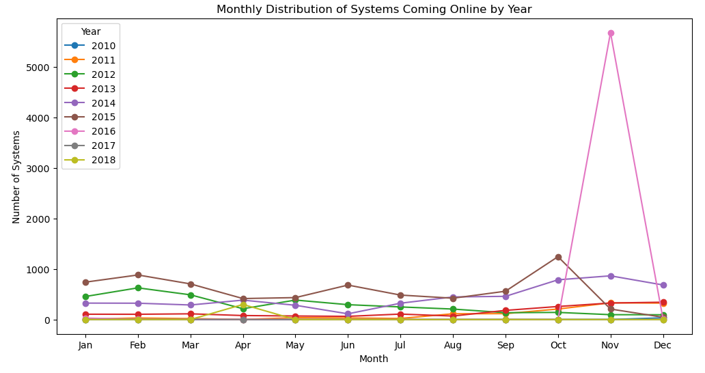
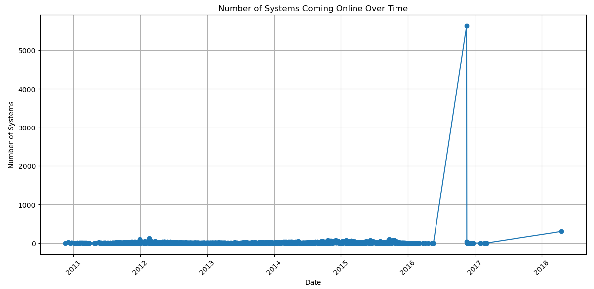

### Exploring the variables: tilt


### Exploring the variables: orientation


### Exploring the variables: Mapping


## Exploring the 30 Minute Dataset
There are 1,824,316 null values in the 30 minute dataset:

<center>

|numNulls_generation|numNulls_timestamp|numNulls_ss_id|
|-------------------|------------------|--------------|
|            1824316|                 0|             0|

</center>
  
## Preprocessing

Steps required for preprocessing:
* Filter out systems with kwp > 50 
* Convert energy output to power generation rate
* Filter out timestamps associated with systems on dates that have fewer than 48 timestamps
* For each ss_id/date grouping with 48 timestamps, get a list of power_kW ordered by timestamp
* Reconstruct the power value measurements using a Fourier Transform to reduce noise
* Perform eigendecomposition to get the top two principal components of the data

### Note: Reasons are included here for later reference --> Move them to Discussion

### Preprocessing: Filtering out High-Capacity Solar PV Systems
Exploring the metadata reveals the presence of several solar PV systems with notably high outlier power generation ratings. The goal of this analysis is to detect anomalies both within a system's daily curves and across all systems. As there are not enough high-capacity systems to make meaningful comparisons between, all systems with a capacity higher than 50 kW are removed from both the 30 minute dataset and the metadata dataset.


### Preprocessing: Converting Energy Output to Power Generation Rate
The "generation_wh" column of the 30 minute dataset gives the amount of Watts generated in the last 30 minutes for a given solar PV system at a given timestamp. However, each solar PV system is associated with a value in the "kwp" column of the metadata which is the power generation capacity of the system in kW. In order to compare these values, the energy outputs in W are converted to average power generated in kW with the following formula:

```math
\text{power}_{\text{kW}} = \text{generation}_{\text{wh}} \times \left(\frac{60}{30}\right) \times \left(\frac{1}{1000}\right)
```

This formula transforms each value in "generation_wh" from the amount of Watts generated in the last 30 minutes to the average power generated over the same 30 minute interval. This new value is saved as "power_kW"

### Preprocessing: Removing Missing Data Points
The energy output of each solar PV system is aggregated and reported at 30 minute intervals, and ideally, each solar PV system would have 48 timestamped reports for each day. Due to the coarse-grained nature of these measurements, any missing data points can greatly affect the shapes of the fitted models. Thus, in order to parameterize the power generation curves as accurately as possible, we need to minimize the number of missing data points.

There are two main categories of missing data points:
1. For a given solar PV system at a given timestamp (ex: 04/24/2019 12:30:00), the energy output was reported as NULL
  1. These were removed in a previous step.
2. For a given solar PV system on a given day, fewer than 48 timestamps exist in the dataset

Out of all pairings of ID-Date, only 144,730 had fewer than 48 timestamps - these were all removed.

### Preprocessing: Collecting Timestamp Groupings

## Parameterizing the Daily Power Generation Curves with the Fourier Transform
The Fourier Transform is used to analyze and parameterize daily power generation curves. This method decomposes power generation data into simpler sinusoidal components, reducing the noise of the measurements and facilitating the identification of patterns and anomalies.

### Defining Constants and Basis
The process begins by defining the necessary constants and creating an orthonormal basis of sinusoids. This involves:
- Setting up 10 pairs of sinusoids at increasing frequencies along with a bias curve.
- Collecting each groupinng of 48 time interval measurements (representing measurements taken at 30-minute intervals over a day).

The basis vectors are constructed as follows:
1. Calculate the step size and initialize the basis vectors.
2. Append cosine and sine functions to the basis vectors for each frequency.

### Visualizing Basis Sinusoids
To understand how each sinusoid contributes to the overall model, we plot the first five basis sinusoids. This visualization helps in comprehending the individual components used in the Fourier Transform.

<p align="center">
  
</p>

### Comparing Projected Reconstructions to Original Curves
Power generation curves are approximated by projecting them onto the basis vectors. This comparison helps in selecting the optimal number of basis vectors for accurate modeling. By using different numbers of basis vectors, it is possible to evaluate how well the approximations match the original curves.

**Comparison of Original and Approximated Curves**:
<p align="center">
  
</p>

### Reconstructing Power Generation Data
For each row of data, power generation values are reconstructed using the basis vectors and the corresponding coefficients. This reconstruction process validates the accuracy of the Fourier Transform in capturing the characteristics of the power generation curves.

**Reconstructed Power Generation Curves**:
<p align="center">
  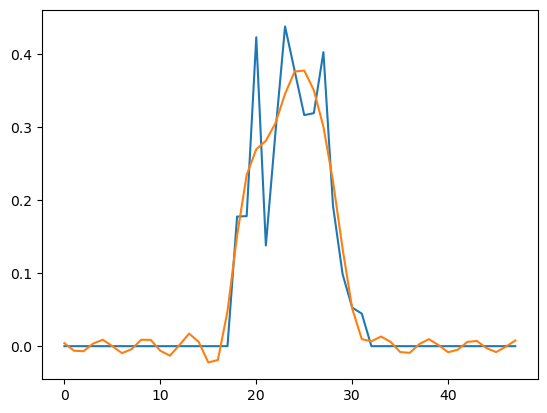
</p>

## Reducing Power Generation Data to 2 Dimensions Using PCA
To visualize the dataset effectively, Principal Component Analysis (PCA) is used to reduce the dimensionality of the power generation data. This process involves several key steps, including computing the covariance matrix, performing eigenvalue decomposition, and projecting the data onto the top principal components.

### Performing PCA on the Data and Visualizing Results
1. **Compute Covariance Matrix**
   The covariance matrix for the given data column is computed, handling NaN values appropriately. To parallelize this operation, the following steps are taken:
     1. Each set of coefficients is grouped up into an array with a 1 inserted into the first element
     2. The outer product of each array is calculated along with the indices of each non-null element
     3. The outer product matrices are reduced by summing up each matrix as well as summing up the indices of non-null elements
     4. From this combined matrix, extract and compute the outer product average which is necessary to compute the covariance matrix
3. **Eigenvalue Decomposition**
   Eigenvalues and eigenvectors are extracted from the covariance matrix via eigenvalue decomposition and ordered by eigenvalue magnitude. This helps in identifying the principal components that explain the most variance in the data.
4. **Plotting Explained Variance**
   The amount of variance explained by each eigenvector is visualized to understand the significance of each component. Note that the first principal component explains nearly 100% of the variance. However, two principal components are used in this analysis to make visualizing the results easier.

<p align="center">
  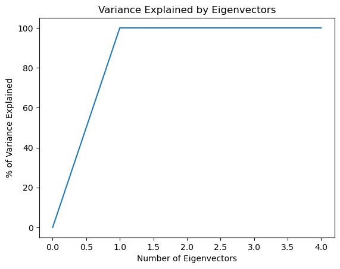
</p>

### Project Data onto Top Principal Components

<p align="center">
  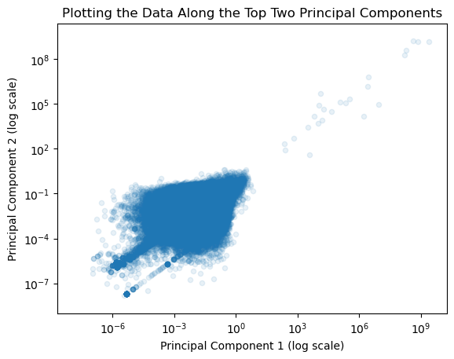
</p>

This process reduces the dataset to 2 dimensions, enabling visualization and further analysis of the power generation data. The resulting data can be plotted to show the distribution along the principal components, aiding in the identification of patterns and anomalies.

## Anomaly Detection Using Principal Component Analysis
To identify anomalies in the power generation data, Principal Component Analysis (PCA) is applied. Anomalies are identified based on their deviation from the main data distribution in the principal component space.

### Identifying Outliers
A grouping of 45 major outliers were detected where PC1 > 10. These outliers are isolated for further analysis to understand the nature of these anomalies. Additionally, a random 10% sample of normal points (where PC1 <= 10) is included for comparison.

**Plotting Outliers:**
<p align="center">
  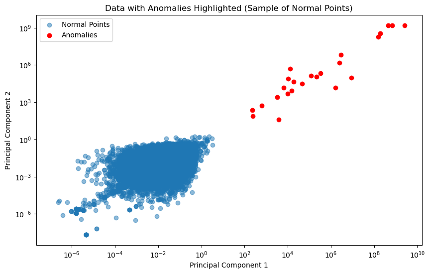 10)" width="600"/>
</p>

### Analyzing Low PC1 With Increasing PC2
Power generation curves are visualized with increasing PC2 values where PC1 is low. This helps to understand how PC2 affects the power generation curves when PC1 is below a certain threshold.

**Visualization of Low PC2 With Increasing PC1:**
<p align="center">
  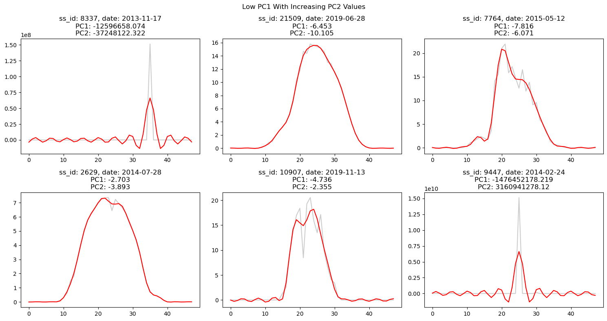
</p>

Additionally, the maximum and minimum power_kW values are plotted for curves where PC1 is low, providing further insights into the behavior of these curves.

**Max and Min Power Generation When PC1 < -2:**
<p align="center">
  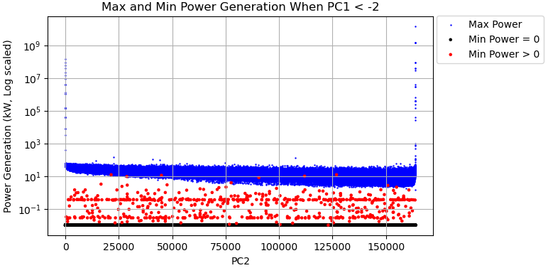
  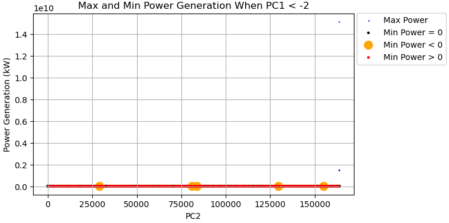
</p>

### Analyzing Low PC2 With Increasing PC1
Similarly, power generation curves are visualized with increasing PC1 values where PC2 is low. This analysis helps to understand the behavior of power generation curves when PC2 is below a certain threshold.

**Visualization of Low PC2 With Increasing PC1:**
<p align="center">
  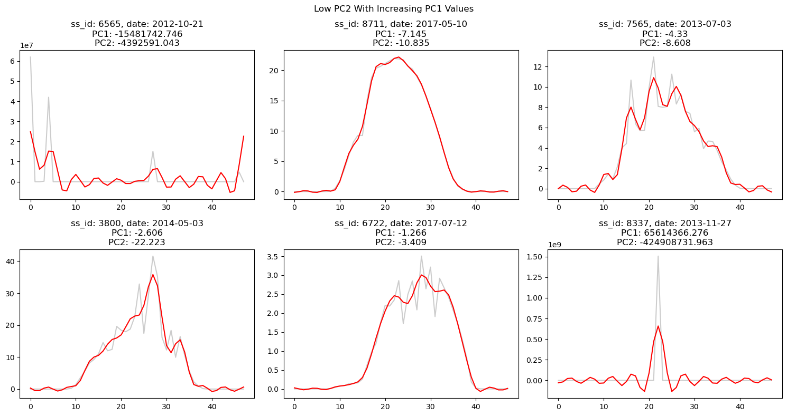
</p>

Additionally, the maximum and minimum power_kW values are plotted for curves where PC2 is low, providing further insights into the behavior of these curves.

**Max and Min Power Generation When PC2 < -3:**
<p align="center">
  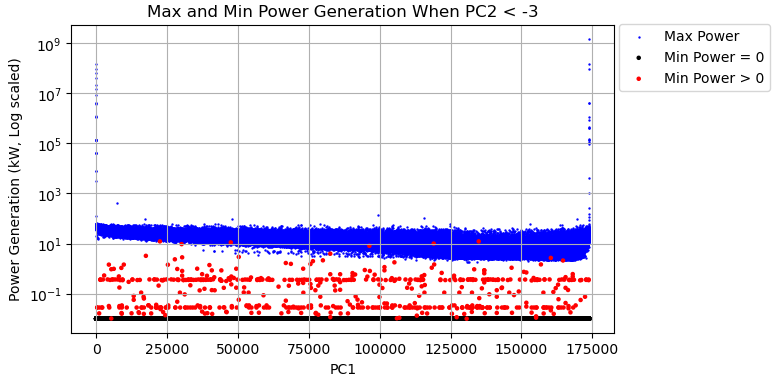
  
</p>

### Locating the PC Boundaries for Anomalies
The boundaries for anomalies in the principal component space are located by setting specific thresholds for PC1 and PC2. This helps in isolating the normal data points from the anomalies. The data points are plotted by their maximum power values.

**Locating PC Boundaries:**\
Number of points within the bounding box: 54,309,396 out of 54,919,174 total\
Total points being plotted: 1,016,304

**Visualization of PC Boundaries for Anomalies:**

The vast majority of data points (54,309,396) have principal components within the range PC1 = [-1.75, 0.25] and PC2 = [-2.5, 0.5]. For this analysis, all data points outside of this bounding box are considered anomalies.

<p align="center">
  
</p>

These plots identify an interesting relationship between the principal components and the maximum power generated by a given system. When either principal component is too large or too small, the maximum power generated is extremely high. 
However, the distribution is not uniform - instead, it is heavily skewed toward the third quadrant. By limiting the data points to show only lower maximum power values, the distribution becomes much more centered on the identified bounding box.

By identifying and analyzing these anomalies, we can highlight significant deviations in the power generation data and understand their potential causes. This process transforms the power generation data into a more interpretable form, providing valuable insights into its underlying structures and variations.

## Identifying Patterns Between Anomalies and PV System Configurations

Out of nearly 55 million data points, only 609,778 were identified as outliers whose principal components fell outside of the bounding box. To identify any patterns, the distributions between various configuration settings are compared here.

<p align="center">
  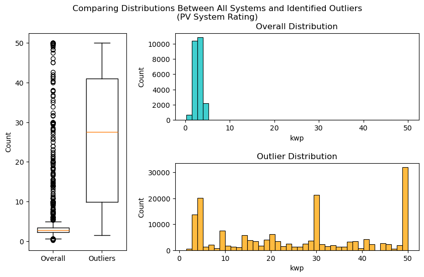
</p>

Most systems represented in this dataset have a power rating centered around 3 kW. However, outlier data points are spread out across the entire axis. There are two notable spikes in the distribution: one with systems rated at around 30 kW and another much larger one with systems rated at around 50 kW.
These could indicate that certain PV systems entirely have a high rate of anomalous measurements.

<p align="center">
  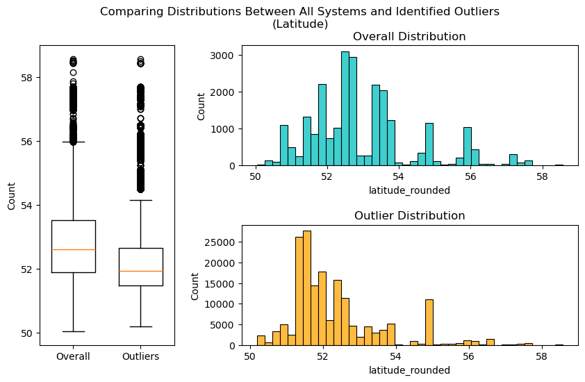
</p>

Most anomalous measures seem to come from latitudes between 51 and 52 with another spike at around latitude 55. While the histogram shapes are very similar, the outliers have a much tighter distribution.

<p align="center">
  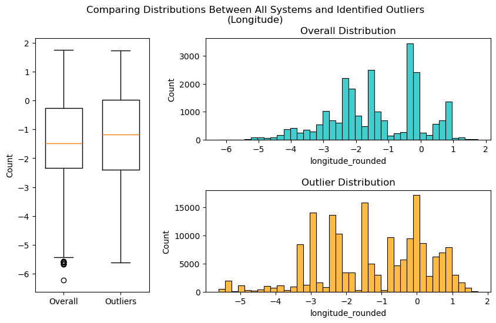
</p>

There doesn't seem to be much indication that the longitude of each system affects the rate of anomalous measurements.

<p align="center">
  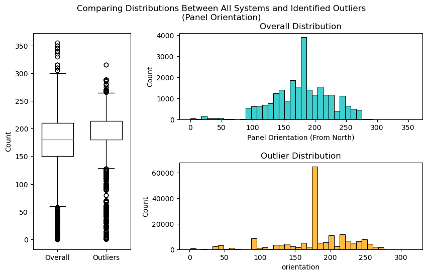
</p>

Overall, the overall panel orientation distribution is very similar to the anomalous panel distributions, but the outlier distribution is slightly more left-skewed.

<p align="center">
  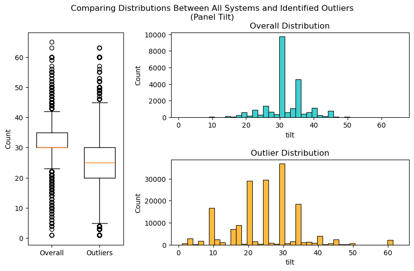
</p>

Panel tilt seems to affect the rate of anomalous measurements - panels tilted closer to horizontal (angles below 30 degrees) appear to produce more anomalous measurements than those tilted more vertically.


-------------------------------------------

## Model 2
Use the identified anomalies as labels to perform supervised machine learning (Without the PC variables). 


[Reference for algorithm descriptions](https://www.datacamp.com/tutorial/introduction-to-anomaly-detection)

# Results

# Discussion
