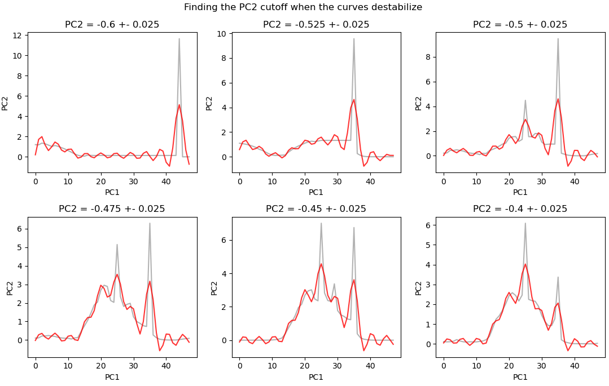
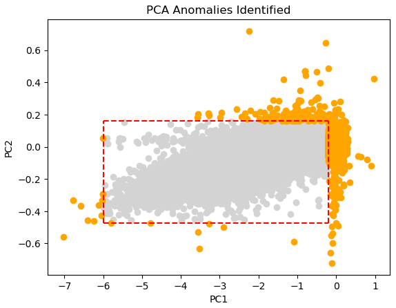
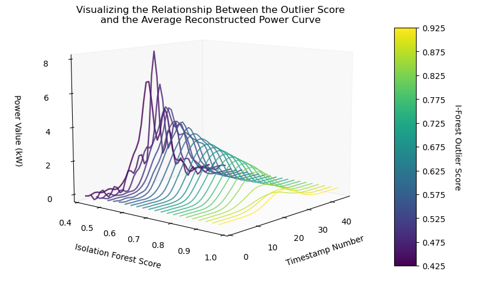
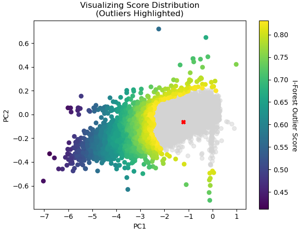

# Introduction
In order to guarantee that energy consumption demands are met, it is important to ensure that vital power generation systems are functioning exactly as intended. However, technology is often imperfect, and systems can randomly fail, often in unpredictable ways. A misbehaving system may be producing less power than is required - it may even break, causing power outages and necessitating costly repairs. Thus, it is incredibly useful to be able to identify when these power generation systems are malfunctioning. However, how can one tell when their system is behaving erratically?

Anomaly detection is the act of examining the data points and identifying rare occurences that deviate significantly from the established set of behaviors ([AWS](https://aws.amazon.com/what-is/anomaly-detection/)). In terms of power generation, this describes instances when a system is not generating power in an expected manner. However, anomaly detection is not a simple process, and in the modern era, we must analyze tons of data to determine anomalous behaviors. Moreover, as anomalies are typically rare and unpredictable, real-world datasets generally do not have labeled anomalous instances. In order to identify an anomaly, one must first define what constitutes an anomaly.

Utilizing a comprehensive time-series dataset featuring over 2.6 billion rows of 30-minute interval power generation data from over 20,000 solar photovoltaic (PV) systems and their respective panel configurations, sourced from the OpenClimateFix repository hosted on Hugging Face, we aim to detect outlier instances that exhibit abnormal power generation patterns. In order to simplify the process of anomaly identification, we will first decompose the power generation curves into their sinusoidal components, then apply Principal Component Analysis (PCA) to identify anomalies within a reduced dimensional space. By providing a framework to identify anomalous instances, this project enables companies to better maintain optimal power generation behavior, thereby contributing to the sustainability and efficiency within their solar PV systems.

## Dataset
The dataset that we used in this analysis can be obtained [here](https://huggingface.co/datasets/openclimatefix/uk_pv) on HuggingFace. It is gated, so it requires an account to access.

There are five datasets available in this repository, but only 2 will be used in this analysis:
* **30min.parquet**: Contains timestamped power generation values on different solar PV systems in the UK from 2010 to 2021
* **metadata.csv**: Provides supplemental information on the setup configurations from over 20,000 individual solar PV systems.

### **30min.parquet**

The 30 minute dataset has 2,644,013,376 rows representing timestamped energy output measurements from various solar PV systems located across the UK. There are three columns:
1. **generation_wh**: The amount of energy outputted over 30 minutes in Wh (double)
2. **datetime**: The corresponding timestamp of when the measurement was made (timestamp_ntz)
3. **ss_id**: The solar PV system ID number (long)

Each row in this dataset represents a single timestamped energy generation measurement from an individual solar PV system:

<div align="center">

|generation_wh|           datetime|ss_id|
|-------------|-------------------|-----|
|          0.0|2010-11-18 00:00:00| 2405|
|          0.0|2010-11-18 00:30:00| 2405|
|          0.0|2010-11-18 01:00:00| 2405|

</div>

<div align="center">
<b>Table 1:</b> Three example rows from the 30min dataset
</div>

### **metadata.csv**

The metadata dataset has 24,662 rows containing supplementary information on how each solar PV system was configured. Notably, there are more PV systems identified in the metadata dataset than the number actually represented in the 30 minute dataset. There are eight columns:
1. **ss_id**: The solar PV system ID number (integer)
2. **latitude_rounded**: The latitude that the solar PV system is located (double)
3. **longitude_rounded**: The longitude that the solar PV system is located (double)
4. **llsoacd**: This variable is not defined in the source repo (string)
5. **orientation**: The direction angle from North that the solar PV system faces (double)
6. **tilt**: The tilt angle of the solar PV system (double)
7. **kwp**: The energy generation capacity of the solar PV system in kw (double)
8. **operational_at**: The date when the solar PV system was activated (date)

Each row in this dataset contains the system configuration for an individual solar PV system:

<div align="center">

|ss_id|latitude_rounded|longitude_rounded|  llsoacd|orientation|tilt| kwp|operational_at|
|-----|----------------|-----------------|---------|-----------|----|----|--------------|
| 2405|           53.53|            -1.63|E01007430|      180.0|35.0|3.36|    2010-11-18|
| 2406|           54.88|            -1.38|E01008780|      315.0|30.0|1.89|    2010-12-03|
| 2407|           54.88|            -1.38|E01008780|      225.0|30.0|1.89|    2010-12-03|

</div>

<div align="center">
<b>Table 2:</b> Three example rows from the metadata dataset
</div>

## Setting Up the Environment
We utilize the following non-standard Python libraries in our analysis - these need to be set up via pip install or conda install methods.
* ipyleaflet is used to generate maps to visualize the locations of the solar PV systems in this dataset.
  * [[Setup documentation]](https://ipyleaflet.readthedocs.io/en/latest/installation/index.html)

# Methods

## Exploring the Metadata Dataset

### Null Values
There are 36 null values in the metadata dataset, specifically in the operational_at column:

<div align="center">

|ss_id|latitude_rounded|longitude_rounded|  llsoacd|orientation|tilt| kwp|operational_at|
|-----|----------------|-----------------|---------|-----------|----|----|--------------|
|    0|               0|                0|        0|          0|   0|   0|            36|

</div>

<div align="center">
<b>Table 3:</b> The null values in the dataset
</div>

### Exploring the variables: Kwp (Solar PV System Power Rating)
Most of the PV systems represented in this dataset have fairly low power ratings in the range of 2-4 kW. However, there are some notable outliers with kwp values up to and exceeding 200 kW. The below boxplot shows the distribution across the entire metadata dataset, while the histograms show the distribution limited to the PV systems that are also in the 30min dataset.

<p align="center">

</p>

<p align="center">


</p>

<div align="center">
<b>Figure 1.a (Top):</b> The distribution of kwp values in the metadata dataset. Note how the vast majority of PV systems are located in the low range of the kwp scale.
<br>
<b>Figure 1.b (Bottom Left):</b> The distribution of kwp among PV systems present in the 30min dataset (limited to systems up to 50 kW)
<br>
<b>Figure 1.c (Bottom Right):</b> The distribution of kwp among <i>all</i> PV systems present in the 30min dataset
</div>


### Exploring the variables: Panel Tilt
Most systems are oriented such that the panels are tilted at about 30 degrees or 35 degrees. The distribution then tapers off fairly uniformly at 10 degrees and 50 degrees. Interestingly, there is a tendency toward angles divisible by 5 degrees noted by prominent spikes in the distribution.

<p align="center">

</p>
<div align="center">
<b>Figure 2:</b> Histogram showing the distribution of panel tilt angles for PV systems present in the 30min dataset
</div>

### Exploring the variables: Panel Orientation
Most systems are oriented such that the panels are oriented about 180 degrees from North. Considering that these systems are located in the UK which is, itself, located at a fairly high latitude, this direction may be maximizing the power generated in this region. However, there is also a notable cluster of systems oriented in the 0-50 degree range which bucks this trend.

<p align="center">

</p>
<div align="center">
<b>Figure 3:</b> Histogram showing the distribution of panel orientation angles for PV systems present in the 30min dataset
</div>

### Exploring the variables: Mapping via iPyLeaflet
These systems are plotted on a map using iPyLeaflet to identify any patterns between system location and configuration parameters. The PV systems in the dataset are mainly located in England and Scotland and are particularly concentrated in populated regions. However, there are no obvious patterns between where a system is located and the other configuration parameters:

<p align="center">

</p>

<div align="center">
<b>Figure 4:</b> Map showing the general location of all PV systems present in the 30min dataset. Brighter regions indicate higher densities of PV systems.
</div>

<br>

### Coloring Systems by System Power Rating:

The majority of solar PV systems throughout the country have very low power output ratings. There are few with higher power output ratings, and these are located close to major population centers.

<p align="center">

</p>
<div align="center">
<b>Figure 5:</b> Map showing PV systems colored by kwp value
</div>
<br>

### Coloring Systems by Panel Orientation:

Most panels throughout the country are oriented at 180 degrees as identified earlier without any particular geographic trends.

<p align="center">

</p>
<div align="center">
<b>Figure 6:</b> Map showing PV systems colored by orientation value
</div>
<br>

### Coloring Systems by Panel Tilt:

Most panels throughout the country are tilted at about 30 degrees as identified earlier without any particular geographic trends.

<p align="center">

</p>
<div align="center">
<b>Figure 7:</b> Map showing PV systems colored by tilt value
</div>
<br>


## Exploring the 30 Minute Dataset
There are 1,824,316 null values in the 30 minute dataset, specifically in the energy generation variable. These are timestamps where, for whatever reason, there is no energy generation measurement recorded:

<div align="center">

|generation_wh|datetime|ss_id|
|-------------|--------|-----|
|      1824316|       0|    0|

</div>
<div align="center">
<b>Table 4:</b> The null values in the 30min dataset
</div>
<br>

**Number of Timestamped Entries per Year**

Though the dataset spans the range 2010 to 2021, the number of timestamped entries from each year varies greatly. Most of the timestamps in the dataset fall within the range 2015-2021, with the range 2017-2020 being particularly highly represented. 2010 and 2011 are both represented quite poorly, especially relative to all other years in the dataset.

<p align="center">
  
</p>
<div align="center">
<b>Figure 8:</b> Histogram showing the number of timestamped entries recorded each year. Note how most of the data falls within the 2015-2021 range.
</div>
<br>

### Visualizing the Power Curves
In order to visualize the power being generated by a system throughout the course of a day, the timestamps for a given ss_id for a given date must be collected in sequential order. The following figure shows three curves with very different shapes, revealing how variable the power curves can be.

<p align="center">

</p>
<div align="center">
<b>Figure 9:</b> Comparing three randomly selected power curves from 2019-05-06.
<br>
System 2607 has an initial spike followed by a smaller, secondary spike.
<br>
System 2660 has a tiny energy measurement at the start of the day, but no power measurements afterward.
<br>
System 14531 has three successively larger spikes over the course of the day.
</div>
<br>
  
# Preprocessing
First, all systems outside of the interquartile range of the kwp variable (IQR: 2.28 <= kwp <= 3.42) are filtered out of the dataset. To better relate the energy generation values to the solar PV system power rating, the energy generation values, measured as kW*(30 minutes) are converted into average power generation values, measured as kW. 

The timestamped data is then grouped by ss_id and date and collected into sequences of power generation values. Each sequence represents the power generated by a single system over a single day. The dataset is then filtered further such that only groupings with 48 non-null timestamped power generation measurements are retained.

**The Formula Used to Convert the Energy Generation Values to Power Generation Values:**
```math
\text{power}_{\text{kW}} = \text{generation}_{\text{wh}} \times \left(\frac{60}{30}\right) \times \left(\frac{1}{1000}\right)
```

## Reconstructing the Daily Power Generation Curves with the Fourier Transform
The Fourier Transform is used to analyze and parameterize the daily power generation curves. By decomposing the power generation data into simpler sinusoidal components, this method the noise of the measurements and facilitating the identification of patterns and anomalies.

### Defining the Sinusoidal Basis
The process begins by defining the necessary constants and creating an orthonormal basis of sinusoids. This involves:
- Setting up 10 pairs of sinusoids at increasing frequencies along with a bias curve. This results in a total of 21 basis vectors.
- Collecting each grouping of 48 time interval measurements into an array for processing.

The basis vectors are constructed as follows:
1. Calculate a step size and formulate the basis vectors as a bias vector and cosine/sine function pairs with increasing frequency values.
2. Append the desired number of vectors to an array to prepare for matrix operations.

### Visualizing the Basis
To understand how each sinusoid contributes to the overall model, we plot the first five basis sinusoids. This visualization helps in understanding how the individual components come together to better approximate the original curves. The first basis vector is a flat bias curve which helps capture the curve's height while the rest of the basis vectors are sinusoids of varying frequency to capture the complexity of the waveforms.

<p align="center">
  
</p>
<div align="center">
<b>Figure 10:</b> Plotting the first five sinusoids of the basis. This includes a flat bias curve and two sine/cosine pairs, each with two different frequencies.
</div>
<br>

### Comparing Projected Reconstructions to Original Curves
The power generation curves are approximated by projecting them onto the basis vectors. The following figure shows how increasing the number of basis vector projections makes the resulting reconstruction more accurate. For our analysis, all 21 basis vectors are used to reconstruct the curves as accurately as possible while still minimizing the overall noise in the measurements.

<p align="center">
  
</p>
<div align="center">
<b>Figure 11:</b> Visualizing how the reconstruction approximates the original power curve at increasing accuracy when more basis vectors are utilized. Simpler curves are approximated quite well with only a few vectors while more complicated ones require the full basis for accurate approximation.
</div>
<br>

## Anomaly Detection with Principal Component Analysis (PCA)
To aid in the identification of anomalous curves, PCA is used to reduce the dimensionality of the reconstructed power generation data to just 2 dimensions. This process involves several key steps, including computing the covariance matrix, performing eigenvalue decomposition, and projecting the data onto the top principal components.

1. **Compute Covariance Matrix of the Reconstructed Curves**
   * The covariance matrix for the given data column is computed, handling NaN values appropriately. To parallelize this operation, the following steps are taken:
     1. Each set of coefficients is grouped up into an array with a 1 inserted into the first element
     2. The outer product of each array is calculated along with the indices of each non-null element
     3. The outer product matrices are reduced by summing up each matrix as well as summing up the indices of non-null elements
     4. From this combined matrix, extract and compute the outer product average which is necessary to compute the covariance matrix
2. **Eigenvalue Decomposition**
   * The eigenvalues and eigenvectors are extracted from the covariance matrix via eigenvalue decomposition and ordered by eigenvalue magnitude. 
3. **Plotting Explained Variance**
   * The amount of variance explained by each eigenvector is visualized to understand the significance of each component.
4. **Projecting the Reconstructions**
   * The reconstructed power values are projected onto the top 2 principal components

## Exploring the Relationships Between the Top 2 Principal Components
As PCA is used to help identify outliers, it is important to determine any important properties that each principal component may represent. To aid this, the major outliers were first filtered out. Then, the data is sampled such that one principal component is set to its respective mean, while the other increases. The generation curves of a small sample of points linearly spaced across the respective PC range are plotted to visualize any changes in shape as the value of one of the principal components increases. Then, the maximum and minimum reconstructed power values are plotted for all points within this range to understand any relationships between the principal components and the power generation curves.

## Anomaly Detection Using PCA
After projecting the data, a series of cutoff values along the top two principal components are used to identify the ranges where the curves switch from normal to anomalous. In order to identify the cutoff values, the change in the average power curve will be analyzed to detect when the curves start to destabilize.

### The anomalies detected here are separated out of the original dataset and are marked as labeled anomalies for later supervised anomaly detection methods. (Change this potentially)

## Further Anomaly Detection Using Statistical Methods
After the initial PCA anomaly filtering, two different statistical approaches are also applied to identify alternative outlier ranges:

1. **Interquartile Range Method**
   * The first and third quartile values along both PC1 and PC2 are identified, and any points that lie outside of the following cutoff values along either PC1 and/or PC2 are marked as anomalies:
    1. Low Cutoff = Q1 - 1.5 x (Q3 - Q1)
    2. High Cutoff = Q3 + 1.5 x (Q3 - Q1)
2. **Z-Score/Standard Deviation Method**
   * Like the previous method, a series of cutoff values along both PC1 and PC2 are identified, and any points that lie outside of the boundaries along either PC1 and/or PC2 are marked as anomalies. This time, the cutoff values are defined using the mean and the sample standard deviation of the datatset:
    1. Low Cutoff = Mean - 3 x STD
    2. High Cutoff = Mean + 3 x STD

## Further Anomaly Detection Using Isolation Forests
An isolation forest is an unsupervised machine learning algorithm which utilizes binary trees to detect anomalies. The algorithm relies on the fact that data points located further away from the centers of distribution are more likely to be quickly separated from the rest of the points when randomly splitting the variable space.

### Typical Isolation Forest Process:
* For each tree:
    * Randomly sample a subset of the data points
    * Recursively split the space along random variables at random values until some stopping criterion (ex: until every leaf node contains 3 points at maximum)
    * Give each point a score which corresponds to how close its leaf node is to the root node
    * Average this score across multiple trees

<p align="center">
  
</p>
<div align="center">
<b>Figure 12:</b> An example of an isolation forest in action. Each line is a single split in the space.
<br>
An anomaly (right) is isolated from the rest of the data with fewer splits compared to a normal point (left). 
<br>
(<a href="https://arpitbhayani.me/blogs/isolation-forest/">Source</a>)
</div>
<br>
 
However, Pyspark does not have any built-in isolation forest algorithms - instead, we use a customized ensemble of single-node binary trees that sequentially split the space with randomized boundary lines, and we record the average score for each point across all iterations.

### Custom Isolation Forest Process:
* First get the minimum and maximum values of the two variables (here, PC1 and PC2)
* Scale PC1 and PC2 to be in the range of 0-1 using Pyspark's MinMaxScaler
* For each forest:
    * For each tree:
        * Pick two random points within the space and get the parameters of the line that connects them in standard form (Ax +  By + C = 0)
        * Split the points into two groups according to which side of the line they are on
        * Give each point a score which corresponds to the fraction of all points that lie on the same side of the line
        * To minimize data storage requirements, track the scores in a running total, then divide by the number of splits for the average scores for each tree.
* The resulting score for each point is averaged across trees, and across forests.

To help visualize this process, the following figure shows 4 randomly generated boundary lines along with the resulting scores assigned to each group. Note how, for each boundary line, the group where the mean PC value is included is given a very high score while the group on the other side is given a score close to zero. This is due to a high concentration of points that surround the mean for this dataset. In the case that the boundary line splits the data in half, both sides get a score that approaches 0.5.

<p align="center">
  
</p>
<div align="center">
<b>Figure 13:</b> Examples of randomly generated boundary lines projected across the principal component space to divide the datasets. This dataset has an incredibly dense cluster of points located near the mean, so typically, the group which includes the mean will have a higher score.
</div>
<br>

This method relies on both randomness and the aggregated results of weak learner predictions, so there can be a lot of variability in results. Thus, averaging the results across multiple trees and even multiple forests is ideal. To maximize the likelihood that an outliers identified with this method are truly anomalous, we will test different combinations of number of trees and number of splits per forest, and we will use the results of the combination with the lowest average standard deviation in scores across all instances.

With the chosen set of scores, we plot the data once again along the principal component axes, but this time with each point colored according to its outlier score. We also plot the change in the average reconstructed power curve as the outlier score decreases.

## Testing Supervised Anomaly Detection Methods Using Labeled Data

## Identifying Correlations Between System Configurations and Outlier Frequency
To see if there is any correlation between the rate of occurence of the identified anomalies with any of the PV system configuration parameters, the data is partitioned into two main groups - outliers and all points. Then, the distributions are visualized with histograms. Only the following outlier subgroups are included for these visualizations:

* Major and close anomalies identified during PCA
* Interquartile Method (Low PC1 / Low PC2 only)
* Z-Score Method (Low PC1 / Low PC2 only)
* Isolation Forest (Score < 0.746)

Similarly, only the following parameters are included in this analysis:

* System Power Rating
* Latitude
* Longitude
* Panel Orientation
* Panel Tilt

# Results

## Comparing the Effectiveness of PCA Performed on the Original Power Values Versus the Reconstructed Values
To understand how reconstructing the power generation curves via the Fourier Transform impacts our analysis, we perform PCA on both and plot the amount of variance explained by both sets of eigenvectors. The first principal component of the reconstructed power values explains over 90% of the variance while the first two principal components of the original power values only explain about 70% of the variance.

<div float="left" align="center">


</div>
<div align="center">
<b>Figure 14:</b> Examining the variance explained by the principal components of the original power values (blue) compared to the principal components of the reconstructed power values from the Fourier Transform (red)
</div>
<br>

The resulting reconstructions model the overall average curve quite well, and they smooth out the spikes and dips in the standard deviations at different timestamps throughout the day.

<p align="center">
  
</p>
<div align="center">
<b>Figure 15:</b> Comparing the mean curves and standard devations of the original power values (blue) and the reconstructed power values from the Fourier Transform (red)
</div>
<br>

## Exploring the Relationships Between the Top 2 Principal Components

### Analyzing Mean PC1 With Increasing PC2
For the following figures, all points where PC1 is within 0.1 of its mean (-1.21) are extracted. Six points are then randomly sampled to visualize how the curves change as PC2 increases along the range. The next figure shows the maximum and minimum power generation values for each point within the range ordered by PC2 value.

When PC2 is relatively low or relatively high, the resulting curves are highly irregular and deviate from a single central peak. There is also a slight U-shape in the bottom of the distribution of maximum power values. However, it is hard to determine any clear patterns as PC2 changes.

<p align="center">
  
</p>

<p align="center">
  
</p>
<div align="center">
<b>Figure 16.a (Top):</b> Visualizing how the typical power curve changes when PC1 is set to its mean value while PC2 increases
<br>
<b>Figure 16.b (Bottom):</b> Visualizing how the maximum and minimum power generation values change across this range
</div>
<br>

### Analyzing Mean PC2 With Increasing PC1
For the following figures, all points where PC2 is within 0.001 of its mean (-0.064) are extracted. Again, six points are then randomly sampled to visualize how the curves change as PC1 increases along the range. The next figure shows the maximum and minimum power generation values for each point within the range ordered by PC1 value.

When PC1 is relatively low or relatively high, the resulting curve has a higher peak value. Within this range, the maximum power value decreases overall as PC1 grows, though there is significant variance between the values.

<p align="center">
  
</p>

<p align="center">
  
</p>
<div align="center">
<b>Figure 17.a (Top):</b> Visualizing how the typical power curve changes when PC2 is set to its mean value while PC1 increases. Note how the height of the curve first drops dramatically, then increases again.
<br>
<b>Figure 17.b (Bottom):</b> Visualizing how the maximum and minimum power generation values change across this range. Note how there is a distinct negative correlation between the value of PC1 and the maximum power generated in the course of the day.
</div>
<br>

### Analyzing when the Principal Components are Zero
A special case happens when both principal components are zero - the resulting power generation curve is flat, corresponding to no power being generated for the entire day. This occurs for 476,230 instances in the dataset, so this special case isn't entirely uncommon. Curiously, the principal components are either both non-zero, or they are both zero - no instance exists where only a single principal component is zero.

<p align="center">
  
</p>
<div align="center">
<b>Figure 18:</b> When both principal components are zero, no power is measured for the day.
</div>
<br>

### Identifying Major Outliers via PCA
When plotting the data along the top two principal components, four major groupings are present:
1. A central grouping of points
2. Points where PC1 > 100
3. Points where PC1 < 100 and PC2 > 100
4. Points where PC1 < 100 and PC2 < -100

In total, 10 major anomalies were identified. The anomaly curves for each example in these groupings are plotted to analyze their shapes. Each curve is associated with at least one or two spikes, and all but one spike occurred in both the positive and negative directions. There are is no particular trend in the value of either PC1 or PC2 as each curve exhibits a fairly similar spike.

<p align="center">
  
</p>

<p align="center">
  
</p>
<b>Figure 19.a (Top):</b> Note how there are clear groupings of major outliers. Also note that the plot axes are on a log scale. The outliers are incredibly far from the main central cluster.
<br>
<b>Figure 19.b (Bottom):</b> Visualizing the individual curves of the major outliers. No particular trend is present that differentiates the groupings.
</div>
<br>

### Identifying Closer Outliers via PCA
After filtering out the major outliers, a total of 7 more outliers can be identified located much more closely to the center of the distribution - these are data points where PC1 and/or PC2 are larger than 1. The curves of these minor outliers are similarly plotted below. These curves also have large spikes in height, but at a significantly lesser scale. Many spikes are also shifted toward the final timestamps, corresponding to a sudden spike in energy product toward midnight hours.

<p align="center">
  
</p>
<p align="center">
  
</p>
<b>Figure 20.a (Top):</b> When zooming in closer to the range, there is still a single far outlier at about PC1 = 30. There are also some visibly distant outliers closer to the central cluster
<br>
<b>Figure 20.b (Bottom):</b> Visualizing the individual curves of the closer outliers. 
</div>
<br>

### Identifying Principal Component Boundaries for Possible Anomalies
To identify principal component boundaries that split the space into non-anomalous curves and anomalous curves, the average power curves at specific principal component values are analyzed. It is difficult to determine what exactly constitutes a "normal" curve as there can be a lot of variation in valid power curves, so for this analysis, the boundaries will be placed where the curves start to destabilize from the typical shape.

For each curve, all instances where the given PC is close to a given value are aggregated such that the mean power generation curve can be visualized.

#### Low PC1 Boundary
When PC1 is -6 or lower, there is a distinct split in the average power curve's spike. The edges of the distribution also become a lot more variable.

<p align="center">
  
</p>
<div align="center">
<b>Figure 21:</b> Visualizing average power curves in the range -7 < PC1 < -5.25
</div>
<br>

#### High PC1 Boundary
When PC1 is -0.02 or higher, the shape of the average curve widens and starts to diverge from a single spike.

<p align="center">
  
</p>
<div align="center">
<b>Figure 22:</b> Visualizing average power curves in the range -0.05 < PC1 < -0.005
</div>
<br>

#### Low PC2 Boundary
All curves within this range are quite different from the bell-shape of the overall average curve's shape. However, when PC2 is lower than -0.475, the shape diverges even further with the spike on the right becoming a more prominent feature.

<p align="center">
  
</p>
<div align="center">
<b>Figure 23:</b> Visualizing average power curves in the range -0.6 < PC2 < -0.4
</div>
<br>

#### High PC2 Boundary
Again, all curves within this range are quite different from the bell-shape of the overall average curve's shape. However, when PC2 is higher than 0.16, the shape of the average curve changes significantly with the bulk of the curve being more evenly distributed throughout the timestamp range.

<p align="center">
  
</p>
<div align="center">
<b>Figure 24:</b> Visualizing average power curves in the range 0.1 < PC2 < 0.2
</div>
<br>

### Visualizing the Principal Component Boundaries
The identified PC boundaries of (-6 < PC1 < -0.02) and (-0.475 < PC2 < 0.16) are displayed below with anomalous points outside of the boundary range highlighted orange.

<p align="center">
  
</p>
<div align="center">
<b>Figure 25:</b> Visualizing the PC boundaries that separate the anomalies identified during the PCA process
</div>
<br>

## Further Anomaly Detection Using Statistical Methods
To aid in the further identification of outliers, the previously identified major and close outlier points were filtered out to minimize the region of interest:

<p align="center">
  
</p>
<div align="center">
<b>Figure 26:</b> Visualizing the PC boundaries that separate the anomalies identified during the PCA process
</div>
<br>

### Interquartile Range Method
As previously stated, the interquartile range method identifies outliers along a single axis using Q1 - 1.5\*IQR and Q3 + 1.5\*IQR as the cutoff values to define outlier points.

<div align="center"> 

|High Cutoff|Low Cutoff|Number of High Outliers| Number of Low Outliers|
|-----------|----------|-----------------------|-----------------------|
|     1.5374|   -3.8405|                      0|                  16108|

</div>

<div align="center">
<b>Table 5:</b> Outlier statistics for PC1 from the interquartile method
</div>
<br>

<div align="center"> 

|High Cutoff|Low Cutoff|Number of High Outliers| Number of Low Outliers|
|-----------|----------|-----------------------|-----------------------|
|     1.5374|   -3.8405|                  93105|                   2463|

</div>

<div align="center">
<b>Table 6:</b> Outlier statistics for PC2 from the interquartile method
</div>
<br>

<p align="center">
  
</p>
<div align="center">
<b>Figure 27.a (Left):</b> Visualizing the outliers identified along the PC1 axis. No high outliers for were identified, so the figure only shows the low outliers.
<br>
<b>Figure 27.b (Right):</b> Visualizing the outliers identified along the PC2 axis
</div>
<br>

#### Visualizing the Average Outlier Curves

The shape of the average curve for both low PC1 outliers and low PC2 outliers are very similar. However, the average curve for the low PC1 outliers has a taller peak at about 3 kW while the low PC2 outliers has a shorter peak at about 2.5 kW. The curve for the low PC2 outlier group is also slightly skinnier.

Unlike the low outlier groups, the shape of the average curve for the high PC2 outliers has no significant difference from the shape of the average curve for the normal points.

<p align="center">
  
</p>
<div align="center">
<b>Figure 28:</b> Visualizing the average power curves for each group of outliers and comparing them to the normal group
</div>
<br>

### Z-Score Method
As previously stated, the Z-score method identifies outliers along a single axis using the mean +- 3 standard deviations as the cutoff values to define outlier points. However, aside from the number of outliers identified, there is almost no visual difference in either the distribution of outlier groups or the average curve shapes.

<div align="center">

|High Cutoff|Low Cutoff|Number of High Outliers| Number of Low Outliers|
|-----------|----------|-----------------------|-----------------------|
|     1.3410|   -3.7621|                      0|                  26770|

</div>

<div align="center">
<b>Table 7:</b> Outlier statistics for PC1 from the Z-score method
</div>
<br>


<div align="center">

|High Cutoff|Low Cutoff|Number of High Outliers| Number of Low Outliers|
|-----------|----------|-----------------------|-----------------------|
|     0.0847|   -0.2128|                  84879|                   3186|

</div>

<div align="center">
<b>Table 8:</b> Outlier statistics for PC1 from the Z-score method
</div>
<br>
</div>


<p align="center">
  
</p>
<div align="center">
<b>Figure 29.a (Left):</b> Visualizing the outliers identified along the PC1 axis. No high outliers for were identified, so the figure only shows the low outliers.
<br>
<b>Figure 29.b (Right):</b> Visualizing the outliers identified along the PC2 axis
</div>
<br>

#### Visualizing the Average Outlier Curves

<p align="center">
  
</p>
<div align="center">
<b>Figure 30:</b> Visualizing the average power curves for each group of outliers and comparing them to the normal group. There is almost no difference between this visualization and the previous visualization obtained using the interquartile method.
</div>
<br>

## Further Anomaly Detection Using Isolation Forests
The isolation forest algorithm incorporates a lot of randomness, so to obtain stable results, a high number of trees and splits is likely ideal. However, the more trees and splits utilized, the more costly the algorithm becomes (in terms of both time-elapsed and memory requirements). Thus, a series of tests were run, each using a different combination of the main two hyperparameters: The number of trees and the number of splits per tree. Each combination was run 5 times with the resulting score for each point averaged across all 5 runs.

As this is an unsupervised method, there are no particularly great ways to analyze the accuracy of these results. Instead, for each run, we compute the standard deviation in scores given to each point, then compute the average standard deviation across all runs. The criterion for the best set of hyperparameters will be the set which produced the lowest mean standard deviation in scores, indicating more certainty in the scores.

<div align="center">

|Number of Trees|Number of Splits|Minimum Score| Maximum Score|Mean Score|Mean Standard Deviation in Scores|
|---------------|----------------|-------------|--------------|----------|---------------------------------|
|              1|              10|       0.3778|        0.9357|    0.8531|                           0.0134|
|              1|              30|       0.3420|        0.9743|    0.9374|                           0.0017|
|              3|              10|       0.4348|        0.9591|    0.9066|                           0.0033|
|              3|              30|       0.4383|        0.9638|    0.9126|                           0.0007|
|              5|              10|       0.4081|        0.9667|    0.9179|                           0.0045|
|              5|              30|       0.4123|        0.9588|    0.9036|                           0.0003|
|              7|              10|       0.3961|        0.9582|    0.9005|                           0.0023|
|              7|              30|       0.4326|        0.9585|    0.9036|                           0.0005|

</div>
<div align="center">
<b>Table 9:</b> Various statistics obtained from each run utilizing different hyperparamater values. 
<br>
While all runs had similar scoring statistics, only a few had the lowest average standard deviation.
</div>
<br>

Overall, the resulting scores were all quite similar, but the combination of 5 trees with 30 splits had the lowest overall standard deviation in scores, so these hyperparameters were chosen. For each point in this resulting model, the individual mean score and standard deviation across runs were extracted, and the shapes of the distributions were visualized.

### Distribution of Mean Scores and Individual Standard Deviations

* Q1 = 0.8936
* Q3 = 0.9349
* Outlier Cutoff = Q1 - 1.5 * (Q3-Q1) = 0.8317

Most points had very high scores with the interquartile range being located from 0.8936 to 0.9349. The lower whisker for outlier values was located at about 0.8317, so all scores below that cutoff were classified as outliers for this analysis. The individual standard deviations were all also extremely small, with most being well under 0.001. The largest standard deviations were around 0.013, so overall, the results for this run were extremely stable.

<p align="center">
  
</p>
<div align="center">
<b>Figure 31.a (Left):</b> Histogram displaying the distribution of scores across the dataset. Most of the data points at or above 0.9, but a decent number of outliers fill the range from about 0.85 to 0.4.
<br>
<b>Figure 31.b (Right):</b> Histogram displaying the distribution of standard deviations in scores across the dataset. Most points had standard deviations incredibly close to zero, indicating a high certainty in the assigned outlier scores.
</div>
<br>

**Visualizing the Resulting Outlier Scores**

The highest scores were located near the mean (demarcated with a red x). The further away from the mean, the lower the score, with the lowest scores being clustered mainly to the far left of the distribution. The figure on the right shows the same data except with the normal points greyed out to highlight the outliers.

<p align="center">
  
</p>
<div align="center">
<b>Figure 32.a (Left):</b> Visualizing the distribution of outlier scores across the principal component space
<br>
<b>Figure 32.b (Right):</b> Same as figure 32.a, except with only the points with scores below the cutoff (0.8317) to visualize the boundary between the outlier group and the normal group.
</div>
<br>

**Visualizing the Average Curve as the Outlier Score Changes**

The average curve for the normal points has a bell-shape that peaked at about 0.8. As the outlier score decreases, the height of the curve's peak rises. At about 0.60, the curve starts to split, and the shape becomes more irregular. At the lowest outlier score values, the curve displays a prominent initial peak at about timestamp 20, followed by a dip, then a smaller peak at about timestamp 30. 

<p align="center">
  
</p>
<div align="center">
<b>Figure 33:</b> Visualizing the change in the average reconstructed power curve as the outlier score decreases. The shape transforms from a short bell-curve to a tall, spiky, complicated curve.
</div>
<br>

A 3D variation of this plot was generated in order to visualize the change in the average curve as the score decreases with less overlaps in the view. Note how the average curves for instances where the scores are 0.6 and below start to diverge significantly from the expected bell-shape:

<p align="center">
  
</p>
<div align="center">
<b>Figure 34:</b> Similar to figure 33, but with the data displayed in a 3D space to visualize the change in shape more easily. 
</div>
<br>

## Supervised Anomaly Detection with Extracted Labeled Anomalies

## Identifying Correlations Between System Configurations and Outlier Frequency
The following plots show the shapes of the distribution in the metadata variables according to anomaly grouping. Compared to the distribution for all points, each of the anomaly groups had higher anomaly counts associated with systems in the higher kwp range. However, none of the other variables had any particular correlation with the frequency of outliers found using any of the methods.

<p align="center">
  
</p>
<div align="center">
<b>Figure 35:</b> Comparing the frequency of outlier occurence at different kwp values
</div>
<br>

<p align="center">
  
</p>
<div align="center">
<b>Figure 36:</b> Comparing the frequency of outlier occurence at different latitude values
</div>
<br>

<p align="center">
  
</p>
<div align="center">
<b>Figure 37:</b> Comparing the frequency of outlier occurence at different longitude values
</div>
<br>

<p align="center">
  
</p>
<div align="center">
<b>Figure 38:</b> Comparing the frequency of outlier occurence at different orientation values
</div>
<br>

<p align="center">
  
</p>
<div align="center">
<b>Figure 39:</b> Comparing the frequency of outlier occurence at different tilt values
</div>
<br>

# Discussion

### Preprocessing: Removing Outlier Solar PV Systems
There are several solar PV systems with notably high outlier power generation ratings, and since the goal of this analysis is to detect anomaly power generation curves, larger curves may end up as false-flags during the detection process. As there are not enough high-capacity systems to make meaningful comparisons, and since the vast majority of systems fall within a tiny subset of kwp values, the dataset was restricted to only systems where the power rating was within the Interquartile Region (between 2.28 and 3.42). This ensures that any detected anomalies will more-likely represent actual anomalies.

The below plot shows the distribution of principal components from the later analysis without removing outlier solar PV systems. More than 99% of the data points fall within the red bounding box, so in a way, all of the points outside of the box may represent anomalies. By limiting the data to systems with lower power values, the distribution shrinks, with any remaining anomalies becoming much more apparent. 

<p align="center">
  
</p>
<div align="center">
<b>Figure 40:</b> Visualizing how when higher kwp systems are included in the dataset, the distribution becomes more spread out, further complicating the anomaly identification process
</div>
<br>

### Preprocessing: Converting Energy Output to Power Generation Rate
The "generation_wh" column of the 30 minute dataset gives the amount of Watts generated in the last 30 minutes for a given solar PV system at a given timestamp. However, each solar PV system is associated with a value in the "kwp" column of the metadata which is the power generation capacity of the system in kW. In order to more easily compare these values, the energy outputs in W*(30 minutes) are converted to average power generated in kW with the following formula:

```math
\text{power}_{\text{kW}} = \text{generation}_{\text{wh}} \times \left(\frac{60}{30}\right) \times \left(\frac{1}{1000}\right)
```

This formula transforms each value in "generation_wh" from the amount of Watts generated in the last 30 minutes to the average power generated over the same 30 minute interval. This new value is saved as "power_kW."

### Preprocessing: Collecting Timestamp Groupings and Removing Missing Data Points
Each entry in the 30 minute dataset consists of the system ID, the timestamp, and the measured energy output. In order to analyze the power output throughout an entire day, the timestamps must first be collected into groups by both system ID and date. As the measurements are taken every 30 minutes, there should be, ideally, 48 timestamps per system ID for every date. Due to the coarse-grained nature of these measurements, any missing data points can greatly affect the shapes of the fitted models, leading to possible false flags. Thus, in order to parameterize the power generation curves as accurately as possible, we need to minimize the number of missing data points.

There are two main categories of missing data points:
1. For a given solar PV system at a given timestamp (ex: 04/24/2019 12:30:00), the energy output was reported as null
2. For a given solar PV system on a given day, fewer than 48 timestamps exist in the dataset

All null values were removed from the dataset, and out of all pairings of ID-Date, only 144,730 had fewer than 48 timestamps - these were all also removed.

## Analyzing the Principal Components of the Reconstructed Power Curves
As PC1 explains over 90% of the total variance, its value has the greatest impact on the overall shape of the curve. When PC1 is extremely high or extremely low, the resulting power generation curve has an anomalous spike which dominates the curve. After filtering out the major outliers and zooming into the normal range, an increase in PC1 is associated with a decrease in the maximum power value up until PC1 = 0. Afterward, the maximum power value appears to spike once again.

On the other hand, PC2 does not have a clear correlation with any particular property of the power generation curves. However, comparing the individual sampled curves *does* seem to imply that when PC2 is extremely high or extremely low, the resulting power generation curve is wider. Considering that these curves represent the power generated from solar PV systems, the most likely curve shape would be somewhere between a bell-curve and a square-curve, depending on environmental factors and the system configurations. However, some curves with high or low PC2 values show power being generated at night, which is highly unlikely.

## Analyzing the Anomalies Identified During the PCA Process

<!-- Figure numbers are indicated in case new figures are added, these must be updated in that case.
Match the figure number to the commented out images! -->

### Major Outliers
Though there are 3 clearly separated groups of major anomalies in 
figure 19.a, <!-- FIGURE NUMBER ################################################################## -->
there actually is no significant difference between the curves from each group (as shown in 
figure 19.b<!-- FIGURE NUMBER ################################################################## -->
). In fact, 8/10 are from the same ss_id, 7635, and all have measurements taken within a fairly small timeframe (2017-11-20 to 2017-12-07). The most significant connection between all of these outlier points is that they contain extreme spikes in the maximum and/or minimum power generation values. The timings of the spike have no clear correlation, though interestingly, two of the curves have dual spikes at different times in the day.

<!-- <p align="center">
  
</p> -->

### Close Outliers
After filtering out the major anomalies, the next set of anomalies can be easily separated from the central cluster. Unlike the previous set of outliers though, a few patterns become clear when analyzing these curves in 
figure 20.b<!-- FIGURE NUMBER ################################################################## -->
:

* When PC1 is relatively high, the amplitude of the curve becomes extremely large. This likely also occurs when PC1 is relatively low.
* When PC2 is relatively high, the peak of the curve is offset from the center. In fact, many of these curves appear to show peak power generation at midnight. This likely also occurs when PC2 is relatively low

These properties correlate with the choice of basis vectors. As stated previously, the basis vectors consist of a single bias curve to offset the reconstructed power curves vertically as well as a series of sinusoidal curves to recreate the shape of the original curves. PC1 appears to correlate with the coefficient for the bias vector while PC2 (and likely the next PCs) appars to correlate with the coefficients for the sinusoidal basis vectors.

<!-- <p align="center">
  
</p> -->

## Analyzing the Effectiveness of Determining Principal Component Boundaries for Outlier Detection
Relying only on principal component values to determine outlier boundaries had mixed results - on one hand, while this approach was effective in dividing the space into normal and anomalous regions, the cutoff values were somewhat arbitrarily set based on minor visual differences in curve shapes. This worked well for the upper boundaries, but most of the curves near the lower boundaries varied quite a lot from the overall average curve. This is partly due to a lack of data - as can be seen in 
figure 25<!-- FIGURE NUMBER ################################################################## -->
, the regions where both lower boundaries were set had very few instances. The process itself is also quite tedious and required a lot of manual adjustments, so overall, this method is fairly inefficient.

Another notable downside is that the resulting boundaries are linear and restricted to being perpendicular to the axes. The distribution of the data is quite non-linear, so setting boundaries in this manner inherently misses many potential anomalies.

To address these shortcomings, we combined the PCA approach with other methods to maximize the utility of the principal components.

<!-- <p align="center">
  
</p> -->

## Analyzing the Effectiveness of Statistical Methods for Outlier Detection
Both the interquartile method and the z-score method resulted in very similar cutoff values and very similar average curve shapes for each grouping of outliers. Both methods resulted in no high PC1 outliers, and both methods had high PC2 outliers that closely resembled the normal curve. Also, both methods show the low PC2 outliers as having skinnier distributions compared to the low PC1 outlier group.

While they were very similar, though, the interquartile method extracted a significantly lower number of low outliers, especially on the PC1 axis, and a slightly higher number of high outliers on the PC2 axis. Neither method worked particularly well at identifying truly anomalous curves, and this is likely attributed to the distribution not being normal. The distribution is highly left skewed, particularly along the PC1 axis. Both methods also set a single boundary line in either direction which limits any further analysis as only a single average curve can be generated to analyze each anomaly grouping.

## Analyzing the Effectiveness of the Isolation Forest for Outlier Detection
The isolation forest was quite effective in separating out outliers from the central cluster in all directions. Most of the points with the lowest scores are located far to the left of the distribution as seen in figure 32.a, and the score increases when approaching the mean. Compared to the previous methods, however, these scores also help to further organize the anomalies into subcategories correlating with distance from the mean. 

Plotting the average reconstruction curve as the score decreases is quite interesting - as seen in 
figure 33<!-- FIGURE NUMBER ################################################################## -->
 and 
figure 34<!-- FIGURE NUMBER ################################################################## -->
, as the outlier score decreases, the height of the curve's peak increases and slowly splits into one tall curve and one slightly smaller peak to the right. Also, the variance seems to increase as the overall curve's shape becomes more jagged. The change in the mean curve reveals that the further away a point's PC1 and PC2 values are from the mean, the more irregular the power generation curve becomes.

Without extra information, it is hard to explain why the average curve seems to split in two so cleanly. One possible explanation could be the prevalence of cloudy/rainy weather in the UK causing anomalous dips and/or spikes in power generation.

<!-- <center>
<p float="left" align="center">
  
  
</p>
</center> -->

### How does the Custom Isolation Forest Compare to the Typical Algorithm?
Considering its simplicity, this algorithm worked fairly well in separating outliers from normal points. Moreover, it gives each point a score based on how often it was separated from the other points - this is an easy metric to calculate and track. Another benefit is how the algorithm generates decision boundaries. The typical isolation forest generates decision boundaries that only consider a single boundary - this creates decision boundaries that only split the space orthgonally relative to one of the axes. Instead of splitting on a single axis, this algorithm is capable of creating decision boundaries in any direction.

However, there are a few drawbacks in the implementation. For one, there are several likely outliers to the lower right of the mean that were not captured by the algorithm. This is likely due to two main factors:

* The algorithm gives each point an average score based on which sides of the randomly generated boundary lines it lies on. If there are not enough lines, then the model does not have a fine-enough granularity to capture outliers that may fall closer to the mean.
* The mean is highly shifted from the center, so the algorithm is less likely to generate lines that split anomalies on the right side away from the mean.

Another large drawback is that this method relies on there being a single main cluster that all other points deviate from. While this worked well with this dataset, the algorithm may not generalize well with datasets that have multiple clusters.

Finally, while the resulting outlier scores clearly showed a transition between normal curves and anomalous curves, the cutoff point was set arbitrarily - this method would be greatly improved if the outlier score were somehow transformed into a probability distribution instead.

## Analyzing the Effectivness of Supervised Outlier Detection Methods

## Analyzing the Distributions of System Configurations Within Anomaly Groupings
Overall, as seen in 
figure 35<!-- FIGURE NUMBER ################################################################## -->
the only variable that appears to correlate strongly with the occurence of anomalies is kwp. This makes sense as many of the average "anomalous" curves were simply normal curves with higher peaks. The average outlier curves identified with both statistical methods had fairly normal shapes that had peaks at 3 kW or lower. Similarly, the average curves identified using the isolation forest followed a similar pattern until the score dropped to 0.65 or below. However, given that the kwp cutoff for solar PV systems to be included in this analysis was 3.42, many of these "anomalies" may actually be legitimate curves. 

This result seems to suggest that, in order to ensure that all identified curves are truly anomalous, the dataset may need to be even further restricted to a smaller smaller subset of solar PV systems.

<!-- <p align="center">
  
</p> -->


# Conclusion

## Fourier Transform for Power Curve Approximation

### Effectiveness of the Fourier Transform in the Anomaly Detection Process
In its original state, the power generation data is reported at 30 minute intervals throughout the course of a day - thus, there are only 48 timestamped measurements that parameterize the curves. As the reported data is averaged throughout each interval, there can be large spikes and dips simply due to unavoidable factors, such as unpredictable weather changes in a day. In order to reduce the noise in the datasets, we applied the Fourier Transform in order to reconstruct the curves using sinusoidal components. This resulted in significantly smoother curves that were easier to compare. Applying PCA to the reconstructions was incredibly effective as well, as the first principal component for the reconstructions explained over 90% of the variance compared to only 38% without the reconstruction. 

However, the reconstructions were not perfect. As they reconstructed the data using sinusoidal components, most resulting curves displayed negative minimum power. Normally, the minimum power should be zero, so any curves that actually had negative minimum power measurements were likely missed. The reconstructions also assume that all of the fluctuations in the measurements are due to noise which should be filtered out - this might not be an entirely accurate assumption.

Overall, the application of the Fourier Transform succeeded in simplifying the anomaly detection process, and it helped to highlight major anomalies in the dataset. However, it might not have been as effective in helping to identify more minor anomalies - in fact, it might have even masked them.

## PCA for Anomaly Detection

### Effectiveness of PCA in Highlighting Anomalies
In this analysis, PCA proved to be an effective method for simplifying the anomaly identification process. By transforming the high-dimensional data into two principal components, we were able to visualize and distinguish most normal data points from anomalous ones. The scatter plots of the first two principal components (PC1 and PC2) clearly showed clusters of normal points and isolated anomalies. By setting cutoff values in the principal component space, these anomalous points can be easily filtered out of the dataset. The specific anomalies identified had particularly high or low PC1 and PC2 values, which correlated with spikes in the measured power and/or shifts in the timing of the peak(s). This indicates that PCA can successfully capture and highlight abnormal variations in the data, particularly those associated with sudden increases in power generation.

Viewing the average power curves at different points in the principal component space also revealed how the shape of the curve changes with the principal components. However, this relationship was complex due to the wide variations in possible power curve shapes. In order to fully parametrize the curves, likely more than two principal components are required.

### Benefits of Using PCA for Anomaly Detection
Most real-world datasets don't have labeled anomalies as it can be difficult to identify which points are actually anomalous. The lack of a labeled dataset heavily restricts the number of available anomaly detection methods which often consist of supervised learning approaches. Identifying anomalies via PCA not only helps in detecting outliers but also enables the creation of a labeled dataset. This labeled dataset can then be used to train and evaluate supervised learning models, enhancing our ability to predict and manage anomalies in future data.

### Drawbacks of Relying Only on PCA for Anomaly Detection
After filtering out the major anomalies identified using PCA, there is a fairly tight cluster of points that remain. In order to further identify anomalies, cutff values have to be set, often arbitrarily. So far, in order to verify that the points are truly anomalies, the power generation curves have to be individually scrutinized. This was fine for the major anomalies as there are relatively few major anomalies. However, this becomes time-consuming and ineffective when approaching the center of the distribution. 

While PCA was effective, combining it with other anomaly detection techniques, such as clustering methods or separate supervised learning using our identified anomalies, could provide a more robust anomaly detection framework. This hybrid approach could help in capturing a wider variety of anomalies that PCA alone might miss.

### How well the labeled anomalies worked with supervised learning?

## Recommendations for Improvement
* **Combine PCA with Other Techniques**
  * For this analysis, we combined PCA with statistical methods and isolation forests to identify anomalous ranges in the principal component space. It would be interesting to see how these methods compare to other common anomaly detection techniques like local outlier factor.
* **Compare PCA on the Reconstructions to PCA on the Original Values**
  * For this analysis, we only looked at the PCA results on the reconstructions. We assumed that the reconstructing the curves first would be more effective, and the resulting amount of variance explained seems to imply that this is indeed the case. However, it would be very useful to compare the results directly to quantify any benefits (if any exist at all).
* **Analyze More Principal Components**
  * While the first principal component explained over 90% of the variance, the remaining components only explain fractional percentages. The first component was clearly connected to the heights of the power curve, but the second component was much harder to analyze and connect to a specific property. Analyzing more principal components would give more insight into the curve shapes and may facilitate the identification of other anomalous curve shapes.

## Final Thoughts
Overall, PCA has shown to be a valuable tool in detecting anomalies within the dataset, especially those related to power spikes. Moreover, the identification of anomalies via PCA helps in creating a labeled dataset, which is crucial for training supervised learning models. By incorporating additional techniques and insights, we can further enhance the model's effectiveness and accuracy, providing a robust framework for anomaly detection and management.

## Collaboration
John worked on transforming the dataset from individual timestamps to a usable collection of power value measurements. He performed both the fourier transform and the principal component analysis, then performed the outlier analyses (PCA, statistical methods, isolation forest) to create a labeled set of anomalous data points.

Zoey worked on developing figures to visualize the dataset and model results. She also tested how well the identified anomalies could act as a labeled dataset for supervised learning methods.
