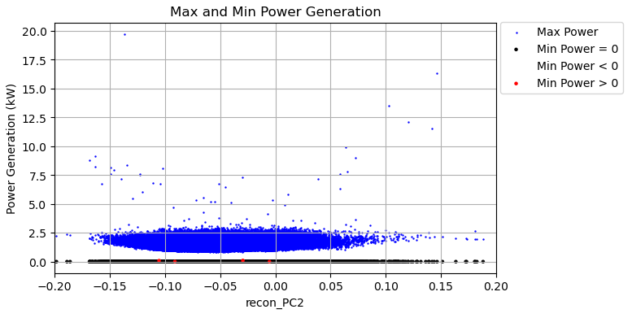

<<<<<<< HEAD
# Detecting Anomalies in Solar Power Generation

Detecting Anomalies in Solar Power Generation by comparing generation curve profiles.

# Introduction
\[Abstract for now --> Build up on this with visuals]
In order to guarantee that energy consumption demands are met, it is important to ensure that vital power generation systems are functioning as intended. By utilizing a comprehensive time-series dataset featuring over 2.6 billion rows of 30-minute interval power generation data from over 20,000 solar photovoltaic (PV) systems and their respective panel configurations, sourced from the OpenClimateFix repository hosted on Hugging Face, we aim to detect outlier panels that exhibit abnormal power generation patterns. Our methodology involves using the Fourier Transform to parameterize daily power generation curves, then applying Principal Component Analysis (PCA) to identify principal components that capture the most variance between the shapes of the curves. We will analyze the distance between a given panel’s typical generation curve and the average curve allowing for the identification of both global and local irregularities. We can then use this data to identify potential solar panel configurations which are more prone toward anomalous power generation. By providing insights into power generation anomalies, this project enables companies to maintain optimal power generation within their PV systems, thereby contributing to the sustainability and efficiency of solar energy systems.

### Dataset
The dataset that we used in this analysis can be obtained [here](https://huggingface.co/datasets/openclimatefix/uk_pv) on HuggingFace. It is gated, so it requires an account to access.

There are five datasets available in this repository, but only 2 will be used in this analysis:
* **30min.parquet**: Contains timestamped power generation values from over 20,000 PV systems in the UK from 2010 to 2021
* **metadata.csv**: Provides supplemental information on the setup configurations of each PV system

The 30 minute dataset has 2,644,013,376 rows representing timestamped energy output measurements from various solar PV systems located across the UK. There are three columns:
1. **generation_wh**: The amount of energy outputted over 30 minutes in Wh (double)
2. **datetime**: The corresponding timestamp of when the measurement was made (timestamp_ntz)
3. **ss_id**: The solar PV system ID number (long)

<center>

|generation_wh|           datetime|ss_id|
|-------------|-------------------|-----|
|          0.0|2010-11-18 00:00:00| 2405|
|          0.0|2010-11-18 00:30:00| 2405|
|          0.0|2010-11-18 01:00:00| 2405|

</center>

The metadata dataset has 24,662 rows containing supplementary information on how each solar PV system was configured. Notably, there are more PV systems identified in the metadata dataset than the number actually represented in the 30 minute dataset. There are eight columns:
1. **ss_id**: The solar PV system ID number (integer)
2. **latitude_rounded**: The latitude that the solar PV system is located (double)
3. **longitude_rounded**: The longitude that the solar PV system is located (double)
4. **llsoacd**: This variable is not defined in the source repo (string)
5. **orientation**: The direction angle from North that the solar PV system faces (double)
6. **tilt**: The tilt angle of the solar PV system (double)
7. **kwp**: The energy generation capacity of the solar PV system in kw (double)
8. **operational_at**: The date when the solar PV system was activated (date)

<center>

|ss_id|latitude_rounded|longitude_rounded|  llsoacd|orientation|tilt| kwp|operational_at|
|-----|----------------|-----------------|---------|-----------|----|----|--------------|
| 2405|           53.53|            -1.63|E01007430|      180.0|35.0|3.36|    2010-11-18|
| 2406|           54.88|            -1.38|E01008780|      315.0|30.0|1.89|    2010-12-03|
| 2407|           54.88|            -1.38|E01008780|      225.0|30.0|1.89|    2010-12-03|

</center>

### Setting Up the Environment
We utilize the following non-standard Python libraries in our analysis - these need to be set up via pip install or conda install methods.
* ipyleaflet [Setup docs](https://ipyleaflet.readthedocs.io/en/latest/installation/index.html)

# Methods

## Exploring the Metadata Dataset

### Null Values
There are 36 null values in the metadata dataset, specifically in the operational_at column:

<center>

|ss_id|latitude_rounded|longitude_rounded|  llsoacd|orientation|tilt| kwp|operational_at|
|-----|----------------|-----------------|---------|-----------|----|----|--------------|
|    0|               0|                0|        0|          0|   0|   0|            36|


</center>

### Exploring the variables: kwp
Most of the PV systems represented in this dataset have fairly low power ratings in the range of 2-4 kW. However, there are some notable outliers, mainly those with kwp well above 50 kW. 

<center>


</center>

### Exploring the variables: tilt
Most systems are oriented such that the panels are tilted at about 30 degrees or 35 degrees. The distribution then tapers off fairly uniformly at 10 degrees and 50 degrees. Interestingly, there is a tendency toward angles divisible by 5 degrees noted by prominent spikes in the distribution.

<center>

</center>

### Exploring the variables: orientation
Most systems are oriented such that the panels are oriented about 180 degrees from North. Considering that these systems are located in the UK which is, itself, located at a fairly high latitude, this direction may be maximizing the power generated in this region. However, there is also a notable cluster of systems oriented in the 0-50 degree range which bucks this trend.

<center>

</center>

### Exploring the variables: Mapping via iPyLeaflet
These systems are plotted on a map using iPyLeaflet to identify any patterns between system location and configuration parameters. The PV systems in the dataset are mainly located  in England and Scotland and are particularly concentrated in populated regions. However, there are no obvious patterns between where a system is located and the other configuration parameters:

<center>

</center>


**Coloring Systems by System Power Rating**:
The majority of solar PV systems throughout the country have very low power output ratings. There are few with higher power output ratings, and these are located close to major population centers.

<center>

</center>

**Coloring Systems by Panel Orientation**:
Most panels throughout the country are oriented at 180 degrees as identified earlier without any particular geographic trends.

<center>

</center>

**Coloring Systems by Panel Tilt**:
Most panels throughout the country are oriented at about 30 degrees as identified earlier without any particular geographic trends.

<center>

</center>


## Exploring the 30 Minute Dataset
There are 1,824,316 null values in the 30 minute dataset:

<center>

|numNulls_generation|numNulls_timestamp|numNulls_ss_id|
|-------------------|------------------|--------------|
|            1824316|                 0|             0|

</center>

** Number of Timestamped Entries per Year **
Though the dataset spans the range 2010 to 2021, the number of timestamped entries from each year varies greatly. Most of the timestamps in the dataset fall within the range 2015-2021, with the range 2017-2020 being particularly highly represented. 2010 and 2011 are both represented quite poorly, especially relative to all other years in the dataset.

<center>
  
</center>
  
## Preprocessing

Steps required for preprocessing:
* Filter out systems outside of the kwp interquartile range (IQR: 2.28 <= kwp <= 3.42)
* Convert energy output to power generation rate
* Filter out timestamps associated with systems on dates that have fewer than 48 timestamps
* For each ss_id/date grouping with 48 timestamps, get a list of power_kW ordered by timestamp
* Reconstruct the power value measurements using a Fourier Transform to reduce noise
* Perform eigendecomposition to get the top two principal components of the data

### Note: Reasons are included here for later reference --> Move them to Discussion

### Preprocessing: Removing Outlier Solar PV Systems
There are several solar PV systems with notably high outlier power generation ratings, and since the goal of this analysis is to detect anomaly power generation curves, larger curves may end up as false-flags during the detection process. As there are not enough high-capacity systems to make meaningful comparisons, and since the vast majority of systems fall within a tiny subset of kwp values, the dataset was restricted to only systems where the power rating was within the Interquartile Region (between 2.28 and 3.42). This ensures that any detected anomalies will more-likely represent actual anomalies.

The below plot shows the distribution of principal components from the later analysis without removing outlier solar PV systems. More than 99% of the data points fall within the red bounding box, so in a way, all of the points outside of the box may reprsent anomalies. By limiting the data to systems with lower power values, the distribution shrinks, with any remaining anomalies becoming much more apparent. 

<p align="center">
  
</p>

### Preprocessing: Converting Energy Output to Power Generation Rate
The "generation_wh" column of the 30 minute dataset gives the amount of Watts generated in the last 30 minutes for a given solar PV system at a given timestamp. However, each solar PV system is associated with a value in the "kwp" column of the metadata which is the power generation capacity of the system in kW. In order to more easily compare these values, the energy outputs in W*(30 minutes) are converted to average power generated in kW with the following formula:

```math
\text{power}_{\text{kW}} = \text{generation}_{\text{wh}} \times \left(\frac{60}{30}\right) \times \left(\frac{1}{1000}\right)
```

This formula transforms each value in "generation_wh" from the amount of Watts generated in the last 30 minutes to the average power generated over the same 30 minute interval. This new value is saved as "power_kW."

### Preprocessing: Removing Missing Data Points
The energy output of each solar PV system is aggregated and reported at 30 minute intervals, and so, ideally, each solar PV system would have 48 timestamped reports for each day. Due to the coarse-grained nature of these measurements, any missing data points can greatly affect the shapes of the fitted models, leading to possible false flags. Thus, in order to parameterize the power generation curves as accurately as possible, we need to minimize the number of missing data points.

There are two main categories of missing data points:
1. For a given solar PV system at a given timestamp (ex: 04/24/2019 12:30:00), the energy output was reported as NULL
2. For a given solar PV system on a given day, fewer than 48 timestamps exist in the dataset

All NULL values were removed from the dataset, and out of all pairings of ID-Date, only 144,730 had fewer than 48 timestamps - these were all also removed.

### Preprocessing: Collecting Timestamp Groupings

## Parameterizing the Daily Power Generation Curves with the Fourier Transform
The Fourier Transform is used to analyze and parameterize daily power generation curves. This method decomposes power generation data into simpler sinusoidal components, reducing the noise of the measurements and facilitating the identification of patterns and anomalies.

### Defining Constants and Basis
The process begins by defining the necessary constants and creating an orthonormal basis of sinusoids. This involves:
- Setting up 10 pairs of sinusoids at increasing frequencies along with a bias curve.
- Collecting each grouping of 48 time interval measurements into an array for processing.

The basis vectors are constructed as follows:
1. Calculate a step size and formulate the basis vectors as a bias vector and cosine/sine function pairs with increasing frequency values.
2. Append the desired number of vectors to an array to prepare for matrix operations.

### Visualizing Basis Sinusoids
To understand how each sinusoid contributes to the overall model, we plot the first five basis sinusoids. This visualization helps in understanding how the individual components are used in the Fourier Transform.

<p align="center">
  
</p>

### Comparing Projected Reconstructions to Original Curves
The power generation curves are approximated by projecting them onto the basis vectors. This comparison shows how increasing the number of basis vector projections makes the resulting reconstruction more accurate.

**Comparison of Original and Approximated Curves**:
<p align="center">
  
</p>

### Reconstructing Power Generation Data
For this analysis, all basis vectors are used to reconstructed the original curve.

**Example Reconstructed Power Generation Curve**:
<p align="center">
  
</p>

## Reducing Reconstructed Power Generation Data to 2 Dimensions Using PCA
Principal Component Analysis (PCA) is used to both reduce the dimensionality of the reconstructed power generation data as well as to enable easier visualization of the results. This process involves several key steps, including computing the covariance matrix, performing eigenvalue decomposition, and projecting the data onto the top principal components.

### Performing PCA on the Data and Visualizing Results
1. **Compute Covariance Matrix**
   The covariance matrix for the given data column is computed, handling NaN values appropriately. To parallelize this operation, the following steps are taken:
     1. Each set of coefficients is grouped up into an array with a 1 inserted into the first element
     2. The outer product of each array is calculated along with the indices of each non-null element
     3. The outer product matrices are reduced by summing up each matrix as well as summing up the indices of non-null elements
     4. From this combined matrix, extract and compute the outer product average which is necessary to compute the covariance matrix
3. **Eigenvalue Decomposition**
   Eigenvalues and eigenvectors are extracted from the covariance matrix via eigenvalue decomposition and ordered by eigenvalue magnitude. 
4. **Plotting Explained Variance**
   The amount of variance explained by each eigenvector is visualized to understand the significance of each component.

This PCA process was performed on  the original power generation values as well as the reconstructed values. The first principal component of the reconstructed power values explains over 90% of the variance while the first two principal components of the original power values only explain about 70% of the variance. 

<p align="center">
  
</p>

The reconstructions model the curves well as the mean curve aligns almost perfectly with the mean reconstruction. The standard deviations with the reconstructions are also generally much lower and smoother than the standard deviations of the original power values.

<p align="center">
  
</p>

### Visualizing the Data along the Top Two Principal Components

<p align="center">
  
</p>

When plotting the data along the top two principal components, four major groupings are present:
1. A central grouping of points
2. Points where PC1 > 100
3. Points where PC1 < 100 and PC2 > 100
4. Points where PC1 < 100 and PC2 < -100

<p align="center">
  
</p>

There appear to be no significant differences between the anomaly groups - in fact, 8/10 are from the same ss_id, 7635, within a fairly small timeframe (2017-11-20 to 2017-12-07). The major connection between all of these outlier points is that they contain extreme maximum and/or minimum power generation values. 

## Exploring the Relationships Between the Top 2 Principal Components
As PCA is used to help identify outliers, it is important to determine any important properties that each principal component may represent. To aid this, the major outliers were filtered out. Then, the data is sampled such that one principal component is set to its respective mean, while the other increases. The generation curves of a small sample of points linearly spaced across the respective PC range are plotted to visualize any changes in shape. Then, the maximum and minimum reconstructed power values are plotted for all points within this range.

<p align="center">
  
</p>

### Analyzing Mean PC1 With Increasing PC2
The points are sampled such that PC1 is within 0.1 of its mean (-1.21)

**Visualizing Power Generation Curves With Increasing PC2:**
<p align="center">
  
</p>

PC2 appears to correlate with a translation of the bulk of the curve from left to right as it increases.

**Max and Min Power Generation With Increasing PC2:**
<p align="center">
  
</p>

No major patterns with power generation are observed as PC2 increases, though at the edges of the distribution, there appear to be large spikes in maximum power measurements

### Analyzing Mean PC2 With Increasing PC1
The points are sampled such that PC2 is within 0.001 of its mean (-0.064)

**Visualizing Power Generation Curves With Increasing PC1:**
<p align="center">
  
</p>

PC1 appears to correlate with the height of the spike in power, though similarly to PC2, the height seems to increase at either end of the spectrum.

**Max and Min Power Generation With Increasing PC1:**
<p align="center">
  
</p>

As PC1 increases, the average maximum power generated decreases across this range. However, the standard deviation is fairly large across the whole range.

### Further Anomaly Detection

While there are a few obvious anomalous groupings of points that are located far from the main cluster, there are many, many more located much closer. Other methods will be used to identify which of these points are truly anomalies.

<p align="center">
  
</p>


## Conclusion

### Effectiveness of PCA in Highlighting Anomalies
In this analysis, PCA proved to be an effective method for identifying anomalies in the dataset. By transforming the high-dimensional data into two principal components, we were able to visualize and distinguish most normal data points from anomalous ones. The scatter plots of the first two principal components (PC1 and PC2) clearly showed clusters of normal points and isolated anomalies.

The specific anomalies identified had particularly high or low PC1 and PC2 values, which correlated with spikes in the measured power. This indicates that PCA can successfully capture and highlight abnormal variations in the data, particularly those associated with sudden increases in power generation.

### Benefits of Using PCA for Anomaly Detection
Identifying anomalies via PCA not only helps in detecting outliers but also enables the creation of a labeled dataset. This labeled dataset can then be used to train and evaluate supervised learning models, enhancing our ability to predict and manage anomalies in future data.

### Recommendations for Improvement
1. **Combine PCA with Other Techniques**: While PCA was effective, combining it with other anomaly detection techniques, such as clustering methods or separate supervised learning using our identified anomalies, could provide a more robust anomaly detection framework. This hybrid approach could help in capturing a wider variety of anomalies that PCA alone might miss.

### Final Thoughts
Overall, PCA has shown to be a valuable tool in detecting anomalies within the dataset, especially those related to power spikes. Moreover, the identification of anomalies via PCA helps in creating a labeled dataset, which is crucial for training supervised learning models. By incorporating additional techniques and insights, we can further enhance the model's effectiveness and accuracy, providing a robust framework for anomaly detection and management.

-------------------------------------------

## Model 2
Use other methods to identify anomalies closer to the central grouping. Could possibly use the major anomalies as labels for supervised methods


## Identifying Patterns Between the Major Anomalies and PV System Configurations (Complete this after further anomaly investigation)

vvv Below is old data, but keeping them in here for template purposes

Out of nearly 55 million data points, only 609,778 were identified as outliers whose principal components fell outside of the bounding box. To identify any patterns, the distributions between various configuration settings are compared here.

<p align="center">
  
</p>

Most systems represented in this dataset have a power rating centered around 3 kW. However, outlier data points are spread out across the entire axis. There are two notable spikes in the distribution: one with systems rated at around 30 kW and another much larger one with systems rated at around 50 kW.
These could indicate that certain PV systems entirely have a high rate of anomalous measurements.

<p align="center">
  
</p>

Most anomalous measures seem to come from latitudes between 51 and 52 with another spike at around latitude 55. While the histogram shapes are very similar, the outliers have a much tighter distribution.

<p align="center">
  
</p>

There doesn't seem to be much indication that the longitude of each system affects the rate of anomalous measurements.

<p align="center">
  
</p>

Overall, the overall panel orientation distribution is very similar to the anomalous panel distributions, but the outlier distribution is slightly more left-skewed.

<p align="center">
  
</p>

Panel tilt seems to affect the rate of anomalous measurements - panels tilted closer to horizontal (angles below 30 degrees) appear to produce more anomalous measurements than those tilted more vertically.


[Reference for algorithm descriptions](https://www.datacamp.com/tutorial/introduction-to-anomaly-detection)

# Results

# Discussion
